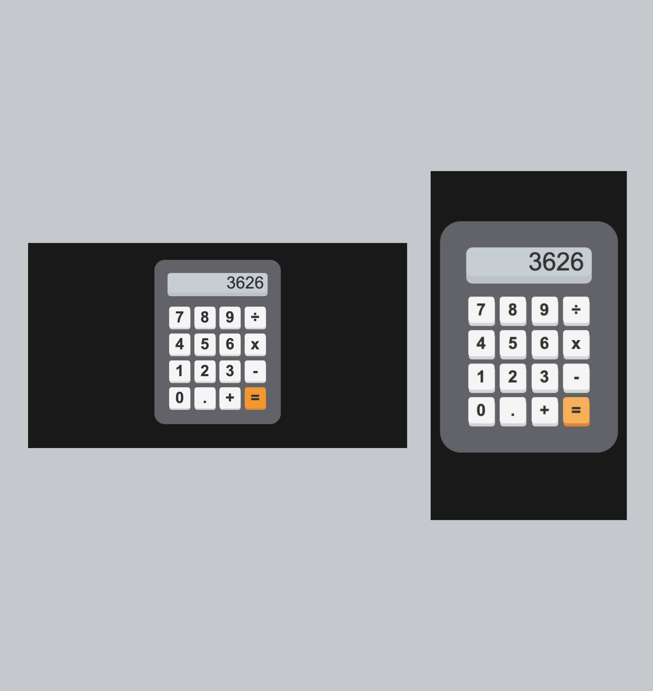

# Frontend Calculator Project

- Build a fully functional calculator using HTML, CSS, and JavaScript only.

## Table of contents

- [Overview](#overview)
  - [The challenge](#the-challenge)
  - [Screenshot](#screenshot)
  - [Links](#links)
- [My process](#my-process)
  - [Built with](#built-with)
  - [What I learned](#what-i-learned)
  - [Continued development](#continued-development)
- [Author](#author)

## Overview

### The challenge

Users should be able to:

- View the optimal layout for the interface depending on their device's screen size
- See hover and focus states for all interactive elements on the page
- Perform calculations using the number, operator, and equals buttons
- See their current input and the result of the calculation in the output element
- Perform calculations with multiple operators and decimal points
- See a clear icon that indicates when the output value is an error

### Screenshot




### Links

- Live Site URL: [Check out my live site](https://omowunmikamil.github.io/frontend-calculator-project/)

## My process

### Built with

- Semantic HTML5 markup
- CSS custom properties
- Flexbox
- CSS Grid
- Mobile-first workflow (Responsive Mobile)
- Media Queries
- JavaScript and DOM Manipulation

### What I learned

```html
<h1>Some HTML code I'm proud of</h1>
<table id="calculator"></table>
<tr><tr>
<td colspan="4"></td>
<input type="text" id="output" readonly>
<td><button onclick="appendToOutput('7')">7</button></td>
<td><button onclick="calculate()" class="orange">=</button></td>
<script src="script.js"></script>
```
```css
@import url('https://fonts.googleapis.com/css2?family=Hanken+Grotesk:ital,wght@0,100..900;1,100..900&family=Montserrat:ital,wght@0,100..900;1,100..900&display=swap');

body {
    font-family: 'Montserrat', sans-serif;
    background-color: hsl(0, 0%, 10%);
    display: flex;
    justify-content: center;
    flex-direction: column;
    align-self: center;
    height: 100vh;
}

table { 
    width: 400px;
    height: 500px;
    margin: 4em auto;
    padding: 3em;
    border: none; 
    border-radius: 40px;
    background-color: rgb(97,99,105);
}

input { 
    width: 380px;
    background-color: rgb(199, 206, 211);
    box-shadow: 0px 14px rgba(198, 204, 208, 0.905);
    color: hsl(0, 0%, 20%);
    font-size: 4rem;
    font-weight: 500;
    text-align: right;
    border: none; 
    border-radius: 12px; 
    margin-bottom: 0.65em;
    padding: 0 14px;
    overflow: hidden;
} 

button {
    width: 80px;
    height: 80px;
    margin: 10px 6px;
    border-radius: 10px;
    border: none;
    background-color: hsl(0, 0%, 96%);
    box-shadow: 1px 6px rgba(242, 241, 241, 0.8);
    color: hsl(0, 0%, 20%);
    font-size: 3.7rem;
    font-weight: bold;
    cursor: pointer;
}

@media screen and (max-width: 375px) {
    input {
        font-size: 3rem;
        width: 240px;
    }
}
```
```js
const output = document.getElementById('output');

function appendToOutput(input) {
    output.value += input;
}

function calculate() {
    try {
        output.value = eval(output.value);
    }
    catch (error) {
        output.value = 'Error';
    }
}
```

### Continued development

JavaScript functionalities
Mobile Responsiveness

## Author

- Website - [Visit my Portfolio Website](https://omowunmikamil.tech)
- Twitter - [Browser_Nerd](https://www.twitter.com/@Browser_Nerd)
